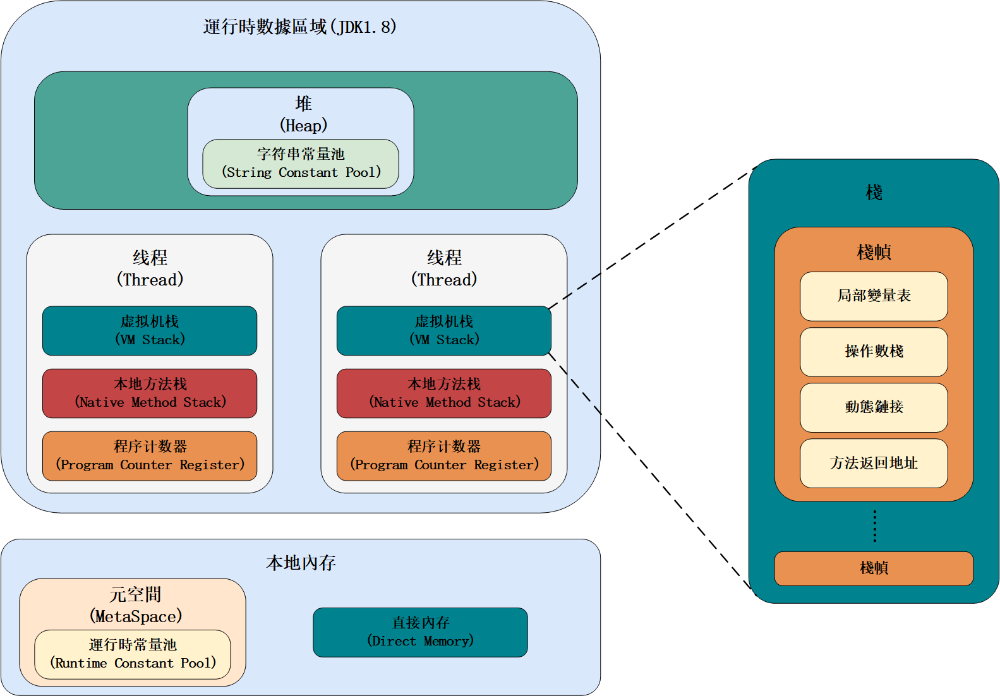

# JVM相关八股


[TOC]


## Java运行时数据区域




### 线程私有的

#### 程序计数器

程序计数器是一块较小的内存空间，可以看作是当前线程所执行的字节码的行号指示器。

作用：

* 字节码解释器通过改变程序计数器来一次读取指令，从而实现代码的流程控制。
* 在多线程的情况下，程序计数器用于记录当前线程执行的位置，从而当线程被切换回来的时候能够知道该线程上次运行到哪里了。

生命周期：与线程相同，随着线程的创建而创建，随着线程的结束而死亡。


#### 虚拟机栈

虚拟机栈由一个个栈帧组成，除了一些 Native 方法调用是通过[本地方法栈](#本地方法栈)实现的，**其他所有的 Java 方法调用都是通过虚拟机栈来实现的**，每个栈帧都拥有**局部变量表、操作数栈、动态链接、方法返回地址**。

* **局部变量表**：主要存放了编译器可知的各种数据类型以及对象引用。
* **操作数栈**：主要作为方法调用的中转站使用，用于存放方法执行过程中产生的中间计算结果以及计算过程中产生的临时变量。
* **动态链接**：主要服务一个方法需要调用其他方法的场景，用于将保存在[运行时常量池](#)中指向方法的符号引用转换为调用方法的直接引用。


#### 本地方法栈

和虚拟机栈所发挥的作用非常相似，区别是：**虚拟机栈为虚拟机执行 Java 方法 （也就是字节码）服务，而本地方法栈则为虚拟机使用到的 Native 方法服务。** 在 HotSpot 虚拟机中和 Java 虚拟机栈合二为一。

本地方法被执行的时候，在本地方法栈也会创建一个栈帧，用于存放该本地方法的局部变量表、操作数栈、动态链接、出口信息。


### 线程共享的

#### 堆

堆的唯一目的就是存放对象实例，**几乎**所有对象实例以及数组都在这里分配内存。（如果某些方法中的对象引用没有被返回或者未被外面使用，那么对象可以直接在栈上分配内存）

Java堆是垃圾收集器管理的主要区域，因此也被成为**GC堆**，可以被划分为*新生代*和*老年代*

JDK7之前，堆内存分为三个部分：

* 新生代内存（Young Generation）：Eden区，Survivor区（S0和S1）
* 老年代（Old Generation）：Tenured区
* 永久代（Permanent Generation）：[方法区](#方法区)在JDK7以前的实现，在JDK8之后被移除，其功能由元空间（MetaSpace）取代，元空间使用的是本地内存。


##### 字符串常量池

**字符串常量池** 是 JVM 为了提升性能和减少内存消耗针对字符串（String 类）专门开辟的一块区域，主要目的是为了避免字符串的重复创建。

JDK7以前字符串常量池存放在永久代。JDK7将*字符串常量池*和*静态变量*从永久代移动到了Java堆中。

**JDK 1.7 为什么要将字符串常量池移动到堆中？**

主要是因为永久代（方法区实现）的 GC 回收效率太低，只有在整堆收集 (Full GC)的时候才会被执行 GC。Java 程序中通常会有大量的被创建的字符串等待回收，将字符串常量池放到堆中，能够更高效及时地回收字符串内存。


#### 方法区

方法区类似一个接口（Interface），有多种实现方式，不同虚拟机对方法区的实现是不同的。在类加载之后，方法区会存储已被虚拟机加载的**类信息、字段信息、方法信息、常量、静态变量、及时编译器编译后的代码缓存等数据。**

HotsPot虚拟机对方法区有两种实现：

* JDK7及以前：永久代（存放在堆中）
* JDK8及以后：元空间（存放在本地内存中）

为什么要将永久代替换为元空间？

* **内存分配**：元空间不再使用固定大小的内存，而是使用本地内存（Native Memory）进行分配。它可以根据需要自动扩展，不再有内存溢出的问题。
* **垃圾回收**：元空间不再进行垃圾回收，而是依赖于本地内存的分配和释放机制。
* **类的卸载**：元空间支持类的动态卸载，当某个类不再被使用时，可以通过垃圾回收机制将其卸载，释放占用的内存。


##### 运行时常量池

Class 文件中除了有类的版本、字段、方法、接口等描述信息外，还有用于存放编译期生成的各种字面量（Literal）和符号引用（Symbolic Reference）的 **常量池表(Constant Pool Table)** 。

字面量包括整数、浮点数和字符串字面量。常见的符号引用包括类符号引用、字段符号引用、方法符号引用、接口方法符号引用。


#### 直接内存

直接内存是一种特殊的内存缓冲区，并不在 Java 堆或方法区中分配的，而是通过 JNI 的方式在本地内存上分配的。

直接内存并不是虚拟机运行时数据区的一部分，也不是虚拟机规范中定义的内存区域，但是这部分内存也被频繁地使用。而且也可能导致 `OutOfMemoryError` 错误出现。

JDK1.4 中新加入的 **NIO（Non-Blocking I/O，也被称为 New I/O）**，引入了一种基于**通道（Channel）**与**缓存区（Buffer）**的 I/O 方式，它可以直接使用 Native 函数库直接分配堆外内存，然后通过一个存储在 Java 堆中的 DirectByteBuffer 对象作为这块内存的引用进行操作。这样就能在一些场景中显著提高性能，因为**避免了在 Java 堆和 Native 堆之间来回复制数据**。

直接内存的分配不会受到 Java 堆的限制，但是，既然是内存就会受到本机总内存大小以及处理器寻址空间的限制。

类似的概念还有 **堆外内存** 。在一些文章中将直接内存等价于堆外内存，个人觉得不是特别准确。

堆外内存就是把内存对象分配在堆（新生代+老年代+永久代）以外的内存，这些内存直接受操作系统管理（而不是虚拟机），这样做的结果就是能够在一定程度上减少垃圾回收对应用程序造成的影响。

------

著作权归Guide所有 原文链接：https://javaguide.cn/java/jvm/memory-area.html#%E7%9B%B4%E6%8E%A5%E5%86%85%E5%AD%98


## Java对象的创建过程

1. 类加载：在Java程序中使用某个类之前，需要将类的字节码加载到内存（方法区）中。

2. 分配内存：在内存中为对象分配足够的内存。

   > 内存碰撞的两种方式
   >
   > * 指针碰撞：
   >   * 使用场合：堆内存规整（即没有内存碎片）的情况下。
   >   * 原理：用过的内存全部整合到一边，没用过的内存放在另一边，中间有个分界指针，只需要向着没用过的内存方向将该指针移动对象内存大小位置即可。
   >   * 使用该分配方式的GC收集器：[Serial](#Serial)，[ParNew](#ParNew)
   >
   > * 空闲列表：
   >   * 使用场景：堆内存不规整的情况下。
   >   * 原理：虚拟机会维护一个列表，该列表中会记录哪些内存块是可用的，在分配的时候，找一块儿足够大的内存块来划分给对象实例，最后更新列表记录。
   >   * 使用该分配方式的GC收集器：[CMS](#CMS)

3. 初始化零值：在分配内存后，JVM会将对象的实例变量初始化为类型的默认值，例如数值类型为0，布尔类型为false，引用类型为NULL。

4. 设置对象头：JVM会在对象的内存空间中设置对象头信息，包括对象的标记信息、哈希码、锁状态等。

5. 返回对象的引用：在构造函数执行完毕之后，会返回对象的引用，将其赋值给变量或作为方法的返回值。


## 对象的内存布局

在 Hotspot 虚拟机中，对象在内存中的布局可以分为 3 块区域：**对象头**、**实例数据**和**对齐填充**。

**Hotspot 虚拟机的对象头包括两部分信息**，**第一部分用于存储对象自身的运行时数据**（哈希码、GC 分代年龄、锁状态标志等等），**另一部分是类型指针**，即对象指向它的类元数据的指针，虚拟机通过这个指针来确定这个对象是哪个类的实例。

**实例数据部分是对象真正存储的有效信息**，也是在程序中所定义的各种类型的字段内容。

**对齐填充部分不是必然存在的，也没有什么特别的含义，仅仅起占位作用。** 因为 Hotspot 虚拟机的自动内存管理系统要求对象起始地址必须是 8 字节的整数倍，换句话说就是*对象的大小必须是 8 字节的整数倍*。而对象头部分正好是 8 字节的倍数（1 倍或 2 倍），因此，当对象实例数据部分没有对齐时，就需要通过对齐填充来补全。


## 对象的访问定位

建立对象就是为了使用对象，我们的 Java 程序通过虚拟机栈上的局部变量表中的 reference 数据来操作堆上的具体对象。对象的访问方式由虚拟机实现而定，目前主流的访问方式有：**使用句柄**、**直接指针**。

### 句柄

在堆中划分了一块内存来作为句柄池，句柄相当于是给实例对象再封装了一层，reference中存储的是对应对象的句柄地址，句柄中包含了两个指针，一个是指向对象示例数据的指针，一个是指向对象类型数据的指针。


### 直接指针

reference中存储的就是堆中对象的地址，对象的对象头中包含了指向对象类型的指针。


## 对象的内存分配

**对象优先在Eden区分配**，当Eden区没有足够空间进行分配时，虚拟机将发起一次[Minor GC](#GC的分类)。

**大对象（需要大量连续内存空间的对象，如数组、字符串）直接进入老年代**，避免将大对象放入新生代，从而减少新生代垃圾回收的频率和成本。

**长期存活的对象将进入老年代。**虚拟机给每个对象分配一个对象年龄（Age）计数器。大部分情况下，对象会现在Eden区分配，如果对象在Eden区出生并且经过第一次Minor GC之后仍能够存活，并且能被Survivor区容纳的话，将被移动到Survivor区，并将对象的年龄设为1。

对象在Survivor区中每熬过一次Minor GC，年龄就加一，当它的年龄达到一个阈值（默认为15，[CMS](#CMS)是6）时，就会被晋升到老年代。


## GC的分类

* Partial GC：只收集部分GC堆的模式
  * 新生代收集（Young GC/ Minor GC）：只对新生代进行垃圾收集；
  * 老年代收集（Major GC/ Old Gc）：只对老年代进行垃圾收集；
  * 混合收集（Mixed GC）：对整个新生代和*部分*老年代进行垃圾收集。
* Full GC：收集整个Java堆和方法区。


## 空间分配担保

**空间分配担保**为了确保Minor GC是安全的，即老年代的最大连续空间大于新生代所有对象总大小或者历次晋升的平均大小。如果是安全的，就会进行Minor GC，否则将进行Full GC。


## 死亡对象判断方法

### 引用计数法

给对象中添加一个引用计数器：

- 每当有一个地方引用它，计数器就加 1；
- 当引用失效，计数器就减 1；
- 任何时候计数器为 0 的对象就是不可能再被使用的。

**这个方法实现简单，效率高，但是目前主流的虚拟机中并没有选择这个算法来管理内存，其最主要的原因是它很难解决对象之间循环引用的问题。**


### 可达性分析法

这个算法的基本思想就是通过一系列的称为 **“GC Roots”** 的对象作为起点，从这些节点开始向下搜索，节点所走过的路径称为引用链，当一个对象到 GC Roots 没有任何引用链相连的话，则证明此对象是不可用的，需要被回收。

**哪些对象可以作为 GC Roots 呢？**

- 虚拟机栈(栈帧中的本地变量表)中引用的对象
- 本地方法栈(Native 方法)中引用的对象
- 方法区中类静态属性引用的对象
- 方法区中常量引用的对象
- 所有被同步锁持有的对象
- JNI（Java Native Interface）引用的对象


## 垃圾收集算法

### 标记-清除

标记-清除（Mark-and-Sweep）算法分为“标记（Mark）”和“清除（Sweep）”阶段：首先标记出所有不需要回收的对象，在标记完成后统一回收掉所有没有被标记的对象。

* 缺点：
  * **效率问题**：标记和清除两个过程效率都不高。
  * **空间问题**：标记清除后会产生大量不连续的内存碎片。

* 回收过程：
  1. 当一个对象被创建时，给一个标志位，假设为0；
  2. 在标记阶段，我们将所有还**存活的对象**（[如何判断对象是否存活？](#死亡对象判断方法)）的标志位设为1；
  3. 扫描阶段清除的就是标志位为0的对象。


### 标记-复制

标记-复制算法将内存分为大小相同的两块，每次只使用其中的一块。当这一块的内存使用完后，标记出所有不需要回收的对象，将其全部复制到另一块内存中，然后再统一收掉所有没有被标记的对象。

* 缺点：
  * **可用内存变小**：变成原来的一半。
  * **不适合老年代**：如果存活对象数量较大，复制性能会变得很差。


### 标记-整理

标记-整理（Mark-and-Compact）算法是根据老年代的特点提出的一种标记算法，标记过程仍然与“标记-清除”算法一样，但后续步骤不是直接对可回收对象回收，而是让所有存活的对象向一端移动，然后直接清理掉端边界以外的内存。

由于多了整理这一步，因此**效率也不高**，适合老年代这种垃圾回收频率不是很高的场景。


## 垃圾收集器

### Serial


* 特点：单线程收集器，在进行垃圾收集工作时必须暂停其他所有工作线程(“Stop The World”)，直到它收集结束。
* 收集算法：
  * 新生代：[标记-复制法](#标记-复制)
  * 老年代：[标记-整理法](#标记-整理)


### ParNew


* 特点：Serial收集器的多线程版本
* 收集算法：
  * 新生代：[标记-复制法](#标记-复制)
  * 老年代：[标记-整理法](#标记-整理)


### CMS


* 特点：CMS (Concurrent Mark Sweep) 以获得最短回收停顿时间为目标的收集器，是第一款真正意义上的并发收集器，它第一次实现了让垃圾收集线程与用户线程（基本上）同时工作。
* 收集算法：[标记-清除法](#标记-清除)
* 缺点：
  * 对CPU资源敏感
  * 无法处理浮动垃圾
  * 使用的回收算法“标记-清除”会导致收集结束时会有大量空间碎片产生。
* 执行过程：
  * **初始标记**：暂停所有其他线程，并记录下直接与root相连的对象（[可达对象](#可达性分析法)）。
  * **并发标记**：同时开启GC和用户线程，用一个闭包结构去记录可达对象。但在这个阶段结束，这个闭包结构并不能保证当前所有的可达对象。因为用户线程可能会不断地更新引用域，所以GC线程无法保证可达性分析的实时性。所以这个算法里会跟踪记录这些发生引用更新的地方。
  * **重新标记**：重新标记阶段是为了修正并发标记期间因为用户程序继续运行而导致标记产生变动的那一部分的标记记录，这个阶段的停顿时间一半会比初始标记阶段稍长，远远比并发标记阶段时间段。
  * **并发清理**：开启用户线程，同时GC线程开始对未标记的区域做清扫。


### G1


**G1 (Garbage-First) 是一款面向服务器的垃圾收集器，主要针对配备多颗处理器及大容量内存的机器，以极高概率满足GC停顿时间要求的同时，还具备高吞吐量性能特征。**

**G1 收集器在后台维护了一个优先列表，每次根据允许的收集时间，优先选择回收价值最大的 Region(这也就是它的名字 Garbage-First 的由来)** 。这种使用 Region 划分内存空间以及有优先级的区域回收方式，保证了 G1 收集器在有限时间内可以尽可能高的收集效率（把内存化整为零）。

**从 JDK9 开始，G1 垃圾收集器成为了默认的垃圾收集器。**

* 特点：
  * **并行与并发**：G1 能充分利用 CPU、多核环境下的硬件优势，使用多个 CPU（CPU 或者 CPU 核心）来缩短 Stop-The-World 停顿时间。部分其他收集器原本需要停顿 Java 线程执行的 GC 动作，G1 收集器仍然可以通过并发的方式让 java 程序继续执行。
  * **分代收集**：虽然 G1 可以不需要其他收集器配合就能独立管理整个 GC 堆，但是还是保留了分代的概念。
  * **空间整合**：与 CMS 的“标记-清除”算法不同，G1 从整体来看是基于“标记-整理”算法实现的收集器；从局部上来看是基于“标记-复制”算法实现的。
  * **可预测的停顿**：这是 G1 相对于 CMS 的另一个大优势，降低停顿时间是 G1 和 CMS 共同的关注点，但 G1 除了追求低停顿外，还能建立可预测的停顿时间模型，能让使用者明确指定在一个长度为 M 毫秒的时间片段内，消耗在垃圾收集上的时间不得超过 N 毫秒。

* 收集算法：从整体来看是基于“标记-整理”算法实现的收集器；从局部上来看是基于“标记-复制”算法实现的。
* 执行过程：
  * **初始标记**
  * **并发标记**
  * **最终标记**
  * **筛选回收**


## 类加载器

* 类加载器是一个负责加载类的对象，用于实现类加载过程中的加载这一步。
* 每个Java类都有一个引用指向加载它的`ClassLoader`。
* 数组类不是通过`ClassLoader`创建的，而是由JVM直接生成的，数组类通过`getClassLoader()`方法获取`ClassLoader`的时候和该数组的元素类型的`ClassLoader`是一致的。

```java
Person[] persons = new Person[5];
Person person = new Person();
System.out.println(persons.getClassLoader() == person.getClassLoader()) // true
```


### 加载规则

JVM 启动的时候，并不会一次性加载所有的类，而是根据需要去动态加载。也就是说，大部分类在具体用到的时候才会去加载，这样对内存更加友好。

对于已经加载的类会被放在 `ClassLoader` 中。在类加载的时候，系统会首先判断当前类是否被加载过。已经被加载的类会直接返回，否则才会尝试加载。也就是说，对于一个类加载器来说，相同二进制名称的类只会被加载一次。


### 内置类加载器

1. **`BootstrapClassLoader`(启动类加载器)**：最顶层的加载类，由 C++实现，通常表示为 null，并且没有父级，主要用来加载 JDK 内部的核心类库（ `%JAVA_HOME%/lib`目录下的 `rt.jar`、`resources.jar`、`charsets.jar`等 jar 包和类）以及被 `-Xbootclasspath`参数指定的路径下的所有类。
2. **`ExtensionClassLoader`(扩展类加载器)**：主要负责加载 `%JRE_HOME%/lib/ext` 目录下的 jar 包和类以及被 `java.ext.dirs` 系统变量所指定的路径下的所有类。
3. **`AppClassLoader`(应用程序类加载器)**：面向我们用户的加载器，负责加载当前应用 classpath 下的所有 jar 包和类。

> `rt.jar`：rt 代表“RunTime”，`rt.jar`是 Java 基础类库，包含 Java doc 里面看到的所有的类的类文件。也就是说，我们常用内置库 `java.xxx.* `都在里面，比如`java.util.*`、`java.io.*`、`java.nio.*`、`java.lang.*`、`java.sql.*`、`java.math.*`。


### 自定义类加载器

如果我们要自定义自己的类加载器，很明显需要继承 `ClassLoader`抽象类。

`ClassLoader` 类有两个关键的方法：

- `protected Class loadClass(String name, boolean resolve)`：加载指定二进制名称的类，实现了双亲委派机制 。`name` 为类的二进制名称，`resolve` 如果为 true，在加载时调用 `resolveClass(Class<?> c)` 方法解析该类。
- `protected Class findClass(String name)`：根据类的二进制名称来查找类，默认实现是空方法。

如果我们不想打破[双亲委派模型](#双亲委派模型)，就重写 `ClassLoader` 类中的 `findClass()` 方法即可，无法被父类加载器加载的类最终会通过这个方法被加载。但是，如果想打破双亲委派模型则需要重写 `loadClass()` 方法。


## 双亲委派模型

当我们想要一个类的时候，由双亲委派模型来决定具体由哪个类加载器来加载。

* `ClassLoader` 类使用委派模型来搜索类和资源。

* 双亲委派模型要求除了顶层的启动类加载器外，其余的类加载器都应有自己的父类加载器。

* `ClassLoader` 实例会在试图亲自查找类或资源之前，将搜索类或资源的任务委托给其父类加载器。

下图展示的各种类加载器之间的层次关系被称为类加载器的“**双亲委派模型(Parents Delegation Model)**”。


注意 ⚠️：双亲委派模型并不是一种强制性的约束，只是 JDK 官方推荐的一种方式。如果我们因为某些特殊需求想要打破双亲委派模型，也是可以的，后文会介绍具体的方法。

另外，类加载器之间的父子关系一般不是以继承的关系来实现的，而是通常使用**组合**关系来复用父加载器的代码。


### 双亲委派模型的执行流程

双亲委派模型的实现代码非常简单，逻辑非常清晰，都集中在 `java.lang.ClassLoader` 的 `loadClass()` 中，相关代码如下所示。

```java
protected Class<?> loadClass(String name, boolean resolve)
    throws ClassNotFoundException
{
    synchronized (getClassLoadingLock(name)) {
        //首先，检查该类是否已经加载过
        Class c = findLoadedClass(name);
        if (c == null) {
            //如果 c 为 null，则说明该类没有被加载过
            long t0 = System.nanoTime();
            try {
                if (parent != null) {
                    //当父类的加载器不为空，则通过父类的loadClass来加载该类
                    c = parent.loadClass(name, false);
                } else {
                    //当父类的加载器为空，则调用启动类加载器来加载该类
                    c = findBootstrapClassOrNull(name);
                }
            } catch (ClassNotFoundException e) {
                //非空父类的类加载器无法找到相应的类，则抛出异常
            }

            if (c == null) {
                //当父类加载器无法加载时，则调用findClass方法来加载该类
                //用户可通过覆写该方法，来自定义类加载器
                long t1 = System.nanoTime();
                c = findClass(name);

                //用于统计类加载器相关的信息
                sun.misc.PerfCounter.getParentDelegationTime().addTime(t1 - t0);
                sun.misc.PerfCounter.getFindClassTime().addElapsedTimeFrom(t1);
                sun.misc.PerfCounter.getFindClasses().increment();
            }
        }
        if (resolve) {
            //对类进行link操作
            resolveClass(c);
        }
        return c;
    }
}
```

结合上面的源码，简单总结一下双亲委派模型的执行流程：

- 在类加载的时候，系统会首先判断当前类是否被加载过。已经被加载的类会直接返回，否则才会尝试加载（每个父类加载器都会走一遍这个流程）。
- 类加载器在进行类加载的时候，它首先不会自己去尝试加载这个类，而是把这个请求委派给父类加载器去完成（调用父加载器 `loadClass()`方法来加载类）。这样的话，所有的请求最终都会传送到顶层的启动类加载器 `BootstrapClassLoader` 中。
- 只有当父加载器反馈自己无法完成这个加载请求（它的搜索范围中没有找到所需的类）时，子加载器才会尝试自己去加载（调用自己的 `findClass()` 方法来加载类）。


### 双亲委派模型的好处

双亲委派模型保证了 Java 程序的稳定运行，可以避免类的重复加载（JVM 区分不同类的方式不仅仅根据类名，相同的类文件被不同的类加载器加载产生的是两个不同的类，**只要加载它们的类加载器不同，那这两个类就必定不相同**），也保证了 Java 的核心 API 不被篡改。

如果没有使用双亲委派模型，而是每个类加载器加载自己的话就会出现一些问题，比如我们编写一个称为 `java.lang.Object` 类的话，那么程序运行的时候，系统就会出现两个不同的 `Object` 类。双亲委派模型可以保证加载的是 JRE 里的那个 `Object` 类，而不是你写的 `Object` 类。这是因为 `AppClassLoader` 在加载你的 `Object` 类时，会委托给 `ExtClassLoader` 去加载，而 `ExtClassLoader` 又会委托给 `BootstrapClassLoader`，`BootstrapClassLoader` 发现自己已经加载过了 `Object` 类，会直接返回，不会去加载你写的 `Object` 类。


