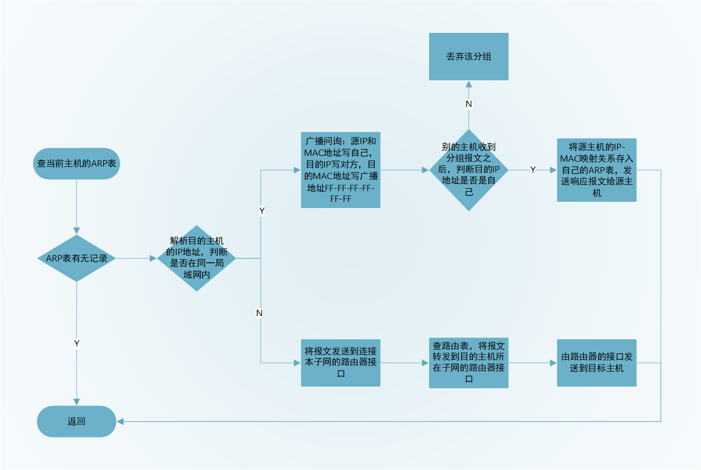

# 计算机网络补充

## 从输入 URL 到页面展示到底发生了什么？

1. DNS解析，将域名转化为IP地址：先找缓存（浏览器缓存、操作系统缓存、路由器缓存）找不到再请求本地DNS服务器，本地DNS服务器查找域名的IP地址有两种方法：
   1. 迭代：本地DNS先找DNS缓存，找不到再访问根DNS服务器，根DNS服务器返回对应的顶级域DNS服务器的地址；本地DNS访问顶级域DNS服务器，顶级域DNS服务器返回权威DNS服务器的地址；本地DNS访问权威DNS服务器，权威DNS服务器返回域名对应的IP地址。
   2. 递归：本地DNS先找DNS缓存，找不到再访问根DNS服务器，根DNS服务器直接去找顶级域DNS服务器，顶级域DNS服务器再找权威DNS服务器，获得对应的IP地址并层层返回。
2. ARP协议：将IP地址转化为MAC地址（**ARP 表、广播问询、单播响应**）

1. TCP连接：三次握手
2. 如果用的是HTTPS协议，还需要TLS四次握手
3. 发送HTTP请求，服务器处理HTTP请求
4. 浏览器解析并渲染页面

## HTTP与HTTPS

### 对称加密和非对称加密

* **对称加密：**加密和解密都用同一个秘钥，运算速度快，密钥必须保密，无法做到安全的密钥交换。
* **非对称加密：**加密和解密用的秘钥不是同一个，公钥加密私钥解密，保证内容传输的安全；私钥加密公钥解密，保证消息不会被冒充。
* **混合加密：**对称加密和非对称加密相结合

### HTTPS RSA四次握手

1. **第一次握手：**客户端发送`Client Hello`消息，里面带有客户端使用的TLS版本号、支持的密码套件列表以及生成的*随机数（Client Random）*
2. **第二次握手：**服务端收到客户端发送的`Client Hello`消息后，会发送一个`Server Hello`消息，里面带有服务器确认的TLS版本号，服务端生成的*随机数（Server Random）*，以及从客户端的密码套件列表中选择了一个合适的密码套件。然后发送`Server Certificate`消息给客户端，里面包含了服务端的数字证书。随后，服务端发送`Server Hello Done`消息，告诉客户端，消息发送完毕，本次打招呼结束。
3. **第三次握手：**客户端收到服务端的数字证书后，验证该证书是否有效，如果有效则认为该服务端可信。此时客户端会生成一个新的随机数（*pre-master*），用服务器的RSA公钥（证书里面带着公钥）加密该随机数，通过`Client Key Exchange`将消息传给服务端。然后服务端发送一个`Change Cipher Spec`消息，告诉服务端接下来要使用对称加密的方式发送消息。最后，客户端发送一个`Encrypted Handshake Message (Finished)`消息，将之前发送的所有数据做个摘要，通过会话秘钥（会话秘钥由*Client Random、Server Random和pre-master*计算得出）加密一下，发送给服务器，让服务器做个验证，验证加密通信是否可用和之前握手信息是否有被中途篡改。
4. **第四次握手**：服务器通过*Client Random、Server Random和pre-master*计算出会话秘钥，对客户端发送的摘要信息进行解密、验证，验证通过后发送`Change Cipher Spec`和`Encrypted Handshake Message`消息，如果双方都验证加密和解密没问题，那么握手正式完成。

### HTTPS ECDHE四次握手

1. **第一次握手：**客户端发送`Client Hello`消息，里面带有客户端使用的TLS版本号、支持的密码套件列表以及生成的*随机数（Client Random）*
2. **第二次握手：**服务端收到客户端发送的`Client Hello`消息后，会发送一个`Server Hello`消息，里面带有服务器确认的TLS版本号，服务端生成的*随机数（Server Random）*，以及从客户端的密码套件列表中选择了一个合适的密码套件。然后发送`Server Certificate`消息给客户端，里面包含了服务端的数字证书。随后，服务端发送`Server Key Exchange`消息，告诉客户端它所选择的椭圆曲线，选好了椭圆曲线相当于椭圆曲线基点 G 也定好了；生成随机数作为服务端椭圆曲线的私钥，保留到本地；根据基点 G 和私钥计算出**服务端的椭圆曲线公钥**，发送给客户端。随后，服务端发送`Server Hello Done`消息，告诉客户端，消息发送完毕，本次打招呼结束。
3. **第三次握手：**验证证书是否有效。客户端生成随机数作为客户端椭圆曲线的私钥，再根据基点G和当前的私钥计算出**客户端的椭圆曲线公钥**，通过`Client Key Exchange`将消息传给服务端。最终双方通过[ECDHE算法](#ECDHE算法)计算出共享秘钥，再由*Client Random、Server Random和ECDHE算法算出的共享密钥*计算出会话秘钥。然后服务端发送一个`Change Cipher Spec`消息，告诉服务端接下来要使用对称加密的方式发送消息。最后，客户端发送一个`Encrypted Handshake Message (Finished)`消息，将之前发送的所有数据做个摘要，通过会话秘钥（会话秘钥由*Client Random、Server Random和pre-master*计算得出）加密一下，发送给服务器，让服务器做个验证，验证加密通信是否可用和之前握手信息是否有被中途篡改。
4. **第四次握手**：服务器通过*Client Random、Server Random和pre-master*计算出会话秘钥，对客户端发送的摘要信息进行解密、验证，验证通过后发送`Change Cipher Spec`和`Encrypted Handshake Message`消息，如果双方都验证加密和解密没问题，那么握手正式完成。

#### ECDHE算法

ECC是建立在基于椭圆曲线的离散对数问题上的密码体制，给定椭圆曲线上的一个点P，一个整数k，求解Q=kP很容易；给定一个点P、Q，知道Q=kP，求整数k确是一个难题。

小红和小明使用 ECDHE 密钥交换算法的过程：

- 双方事先确定好使用哪种椭圆曲线，和曲线上的基点 G，这两个参数都是公开的；
- 双方各自随机生成一个随机数作为**私钥d**，并与基点G相乘得到**公钥Q**（Q = dG），此时小红的公私钥为 Q1 和 d1，小明的公私钥为 Q2 和 d2，不能通过Q和G求得d；
- 双方交换各自的公钥，最后小红计算点（x1，y1） = d1Q2，小明计算点（x2，y2） = d2Q1，由于椭圆曲线上是可以满足乘法交换和结合律，所以 d1Q2 = d1d2G = d2d1G = d2Q1 ，因此**双方的 x 坐标是一样的，所以它是共享密钥，也就是会话密钥**。

这个过程中，双方的私钥都是随机、临时生成的，都是不公开的，即使根据公开的信息（椭圆曲线、公钥、基点 G）也是很难计算出椭圆曲线上的离散对数（私钥）。

**补充：**离散对数

底数 a 和模数 p 是离散对数的公共参数，也就说是公开的，b 是真数，i 是对数。知道了对数，就可以用上面的公式计算出真数。但反过来，知道真数却很难推算出对数。

